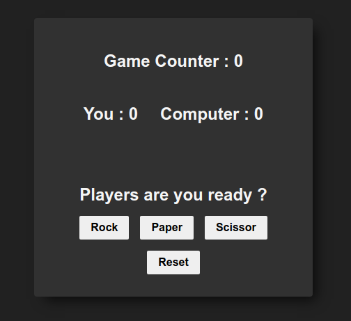

# Rock Paper Scissor

This is a simple implementation of the classic Rock Paper Scissors game using JavaScript, HTML, and CSS.

## Description

In this project, I've created a web-based version of the Rock Paper Scissors game where the user can play against the computer. The user selects their choice by clicking on one of the options (Rock, Paper, or Scissors), and the computer's choice is generated randomly. After the user makes their choice, the result is displayed on the screen, indicating whether the user wins, loses, or draws against the computer.

A user can play for 5 rounds after that computer will show who is the final boss here and then user reset the game.

## Features

- User-friendly interface with clear instructions.
- Interactive game play allowing the user to select their choice with a simple click.
- Real-time display of the user's choice, computer's choice, and game result.
- Score tracking to keep track of the user's performance.

## Technologies Used

- HTML: Used for structuring the web page and defining the game elements.
- CSS: Used for styling the game interface and enhancing user experience.
- JavaScript: Used for implementing game logic, handling user interactions, and updating the game state dynamically.

## Usage

To play the game, simply open the index.html file in a web browser. Click on one of the options (Rock, Paper, or Scissors) to make your choice. The computer will randomly generate its choice, and the result will be displayed on the screen. Keep playing until you decide to reset the game.

## Screenshots

